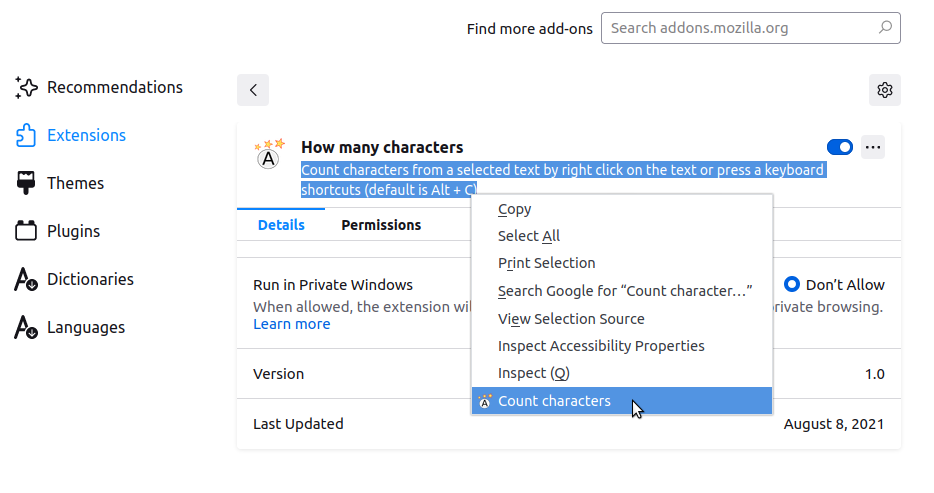
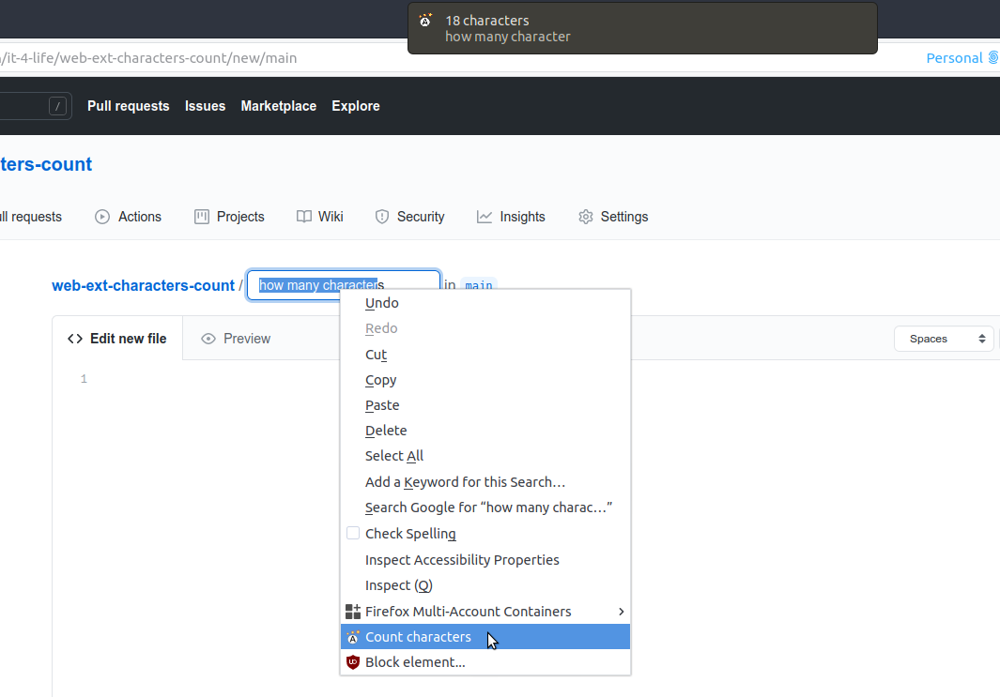

# web-ext-count-characters

Extension to count characters of selected text.

Select you text and use context menu or keyboard shortcut (default is <kbd>Alt</kbd> + <kbd>C</kbd>) to count characters.

# Build

Using [`web-ext`](https://github.com/mozilla/web-ext) to run and build.
