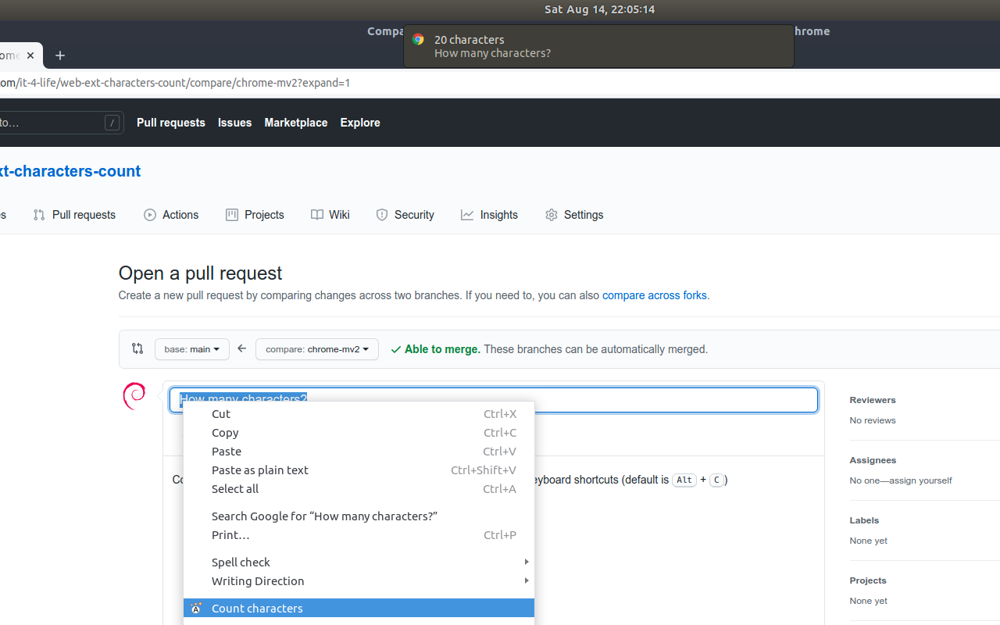

# web-ext-count-characters

Extension to count characters of selected text.

Select you text and use context menu or keyboard shortcut (default is <kbd>Alt</kbd> + <kbd>C</kbd>) to count characters.



# Build

Using [`web-ext`](https://github.com/mozilla/web-ext) to run and build.

```bash
web-ext build --ignore-files screenshots/ --ignore-files firefox-artifacts --ignore-files icons/icon.svg --artifacts-dir chrome-mv2-artifacts
```
